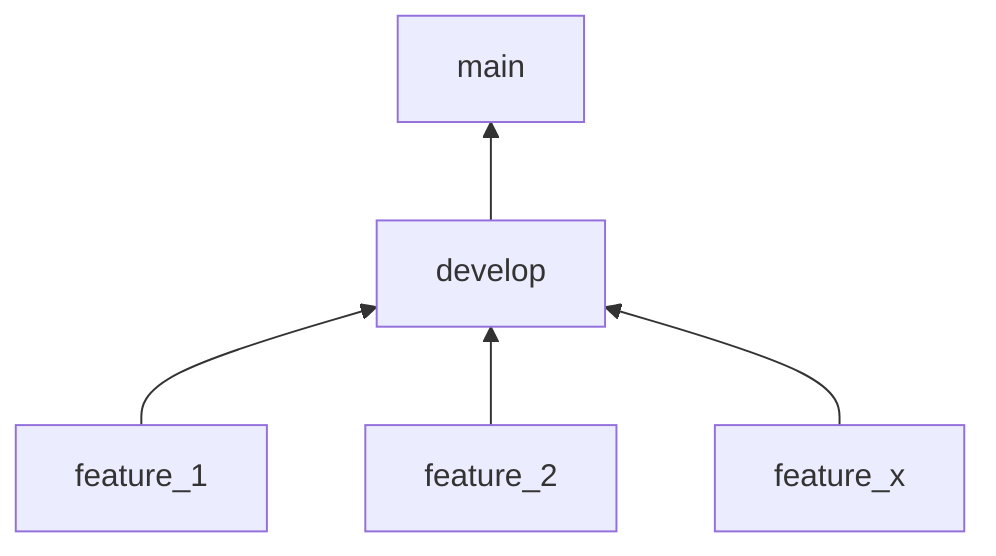

# dbt Capstone Project
The main goal of this project is to deliver the tools and practice required to pass the dbt Analytics Engineering Exam.

## Scenario
- You have been hired by a new company that wants to publish the next big hit of boardgame and needs your help to identify the factors to create this new boardgame, like:
    - Countries with highest demand (based on number of reviews and positive reviews, what are the kind of games that users rank the best).
    - Define metrics to calculate the average rating for each dimension (designers, categories, artists, mechanics)

To do that the company relies on your expertise to perform insights on the datasets available and build recommendations from it.

### Data Model


### Data Dictionary


[Data Dictionary](https://docs.google.com/spreadsheets/d/1W3oXg2I52cy2oLPJQz7Ah4a8TQGju9yByI57JWWFbEc/edit?usp=drive_link)

---

## 1. Development Setup

The following steps will help you to configure your mac for Python development, automation, and command line use.

### 1.1 Setup your Mac

You should install some command line tools, and configure your terminal and editor:

- Setup [Hombebrew](https://hakkoda.atlassian.net/wiki/spaces/DQ/pages/23068946/01+Setup+Homebrew+Git)
- Setup your Mac [terminal and Zsh](https://hakkoda.atlassian.net/wiki/spaces/DQ/pages/23167067/03+Trick-out+Zsh)
- Setup your Mac OS with [Visual Studio Code](https://hakkoda.atlassian.net/wiki/spaces/DQ/pages/56098886/05+Setup+Visual+Studio+Code+VS+Code)

## 2. Clone the Capstone Project Repository

Like all Hakkoda repos, the Capstone Project repo can only be access locally using SSH keys. If you haven't already setup SSH follow these steps or skip straight to the `git clone` command below.

### Generate a New SSH Key

Open a Terminal. If you haven't already, [setup your terminal](https://hakkoda.atlassian.net/wiki/spaces/DQ/pages/23167067/03+Trick-out+Zsh). Then create an SSH key. Ensure that you save your key passphrase in Bitwarden.

``` shell
# Generate the SSH key
# NOTE: 
#  * Update your email address before running the keygen command
#  * Generate the passphrase in Bitwarden and save as something like 
#    "LaptopSSHKey". You will need to provide this passphrase every time 
#    you need to unlock your SSH key
ssh-keygen -t ed25519 -C "your_email@hakkoda.io"

# Add your SSH key to the ssh-agent
eval "$(ssh-agent -s)"

# Update your SSH config to automatically load keys into the ssh-agent and 
# store passphrases in your keychain.
cat <<- EOF >> ~/.ssh/config
Host github.com
  AddKeysToAgent yes
  UseKeychain yes
  IdentityFile ~/.ssh/id_ed25519
EOF

# For MacOS, you can also store your passphrase in the Apple keychain. You may 
# need to provide your mac password to access your keychain. 
ssh-add --apple-use-keychain ~/.ssh/id_ed25519
```

### Add the SSH key to your GitHub account

Follow [instructions](https://docs.github.com/en/authentication/connecting-to-github-with-ssh/adding-a-new-ssh-key-to-your-github-account#adding-a-new-ssh-key-to-your-account) to add your ***public*** key to your GitHub account.

``` shell
# Copy public key to clipboard
pbcopy < ~/.ssh/id_ed25519.pub
```

Go to the [GitHub Keys page](https://github.com/settings/keys) and click the `New SSH key` button. Then:

- **Add a description title**: `LaptopSSHKey`
- **Paste the key**: cmd + v

If requested, enter your GitHub password to save.

Then to enable SSO for your key, click `Configure SSO` and then `Authorize`. Click `continue` to enable SSO. Go through Okta authentication steps. Click `continue` to complete.

When finalized it should look like this. 

### Git Clone Capstone Project

Before cloning your repo, you should open your terminal to a development folder to store our tundra code in.

For example:

``` shell
# Ensure that you are in your "home" directory
cd ~

# Create a new development directory, if it doesn't already exist
mkdir Develop

# Change to the development directory
cd Develop

# Clone tundra (NOTE: uses SSH key)
git clone git@github.com:Hakkoda1/dbt-pt-capstone-project.git
```

## 3. Setup Your Python Environment

Setup Python for dbt use with Snowflake. Because dbt-core is currently compatible with Python versions from 3.8 - 3.11, we have setup the Capstone project to use Python 3.10, but feel free to install any version that is supported by dbt ([source](https://docs.getdbt.com/faqs/Core/install-python-compatibility)).

``` shell
brew install python@3.10 virtualenv
```

Create your Python virtual environment. (If you have used another Python version, please change the code below accordingly)

``` shell
# Setup a project python virtual environement
virtualenv .dbt-env --python=python3.10
```

## 4. Activate Your Virtual Environment

***Every time*** you open a new terminal, you will need to source your Capstone Project Python environment:

``` bash
# Source your project environment
source .dbt-env/bin/activate
```

## 5. Install Python packages required
Run the following command to install the required Python packages for the project:

``` bash
pip install -r requirements.txt
```

## 6. Setup dbt Project

When you clone the repository the dbt project was already initialized, so you can skip the command `dbt init`.

After that, you need to use the `sample-profiles.yml` template file to create your own `profiles.yml` by running the following command inside dbt_capstone_project:

``` bash
# Change to dbt_capstone_project folder
 cd dbt_capstone_project/

# Rename the file sample-profiles.yml to profiles.yml
cp sample-profiles.yml profiles.yml
```


## 5. All about Git

Git is an integral part of version control and CI/CD. It makes contributing to a project with multiple contributors extremely easy. Version control is essential and allows any project to move to any snapshot of time in the development history.

### 5.1.Capstone Project Git Workflow

Capstone Project uses the Simple Flow branching convention with a few types of branches:

- **Short running branches (features)**: temporary dedicated branches for work-in-progress features
   - start from `develop`, to develop changes that are then integrated (merged) back to `develop`
   - enables parallel development with minimal conflicts with other features
   - For example, to create a new feature branch we need to ensure we are basing it off of the most recent `develop` branch and then creating the new branch:

      ``` bash
      git checkout develop
      git pull
      git checkout -b feature_X
      ```

- **Long running branches (protected)**: branches that require pull requests to merge in changes
   - `develop`: changes staged for the next production release, should be merged to main when a release version is ready. This is is part of our CI/CD process.
   - `main`: current version in production, each merge on this branch should be tag and deployed.



### 5.2 Learning Git

Here are some great resources:

- [Intermediate Git (Video)](https://www.youtube.com/watch?v=Uszj_k0DGsg)
- [Atlassian Git Documentation](https://www.atlassian.com/git)
- [Version Control](https://www.atlassian.com/git/tutorials/what-is-version-control)
- [Syncing](https://www.atlassian.com/git/tutorials/syncing)
- [Tutorials](https://www.atlassian.com/git/tutorials)
- [Cheat Sheet](https://www.atlassian.com/git/tutorials/atlassian-git-cheatsheet)

---

### 5.3 Local vs Cloud

Git is a ***distributed version control*** system and Github is a cloud service that provides a shared access. When you clone the repo locally you make a copy of our Hakkoda GitHub repo. A quick way to understand what is happening under the hood is to think of that as a copy of Github locally on your computer and another copy in the cloud.

- `git commit` changes are ways to save your changes with history on your local computer. These are snapshots in time with the differences from the previous commit. These are incremental.
- `git push` is a way to 'push' your local commits into the 'remote' or 'cloud' github so that other contributors can see these changes.
- `git pull` is a way to download any other 'commits' or 'saves' from the github repo (that is in the cloud) to your local working tree. This allows you to get the latest version of what you are working on if others have contributed.

### 5.4 Branching

- [Git Branches](https://www.atlassian.com/git/tutorials/using-branches)
- [Git Pull Requests](https://www.atlassian.com/git/tutorials/making-a-pull-request)

### 5.5 Commiting Changes

- [Git Add](https://www.atlassian.com/git/tutorials/saving-changes)

### 5.6 Fetching / Merging / Pulling

- [Git Fetch](https://www.atlassian.com/git/tutorials/syncing/git-fetch)
- [Git Merge](https://www.atlassian.com/git/tutorials/using-branches/git-merge)
- [Git Pull](https://www.atlassian.com/git/tutorials/syncing/git-pull)

### 5.7 Fixing Changes

- [Undoing Commits & Changes](https://www.atlassian.com/git/tutorials/undoing-changes)

### 5.8 Why Git?

- [Why Should I Use Git?](https://www.atlassian.com/git/tutorials/why-git)

---
