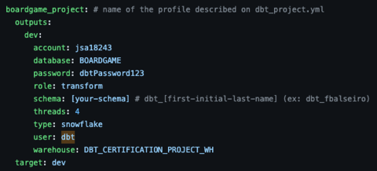

# Exercise:

## Customizing a profile directory

The parent directory for profiles.yml is determined using the following precedence:

1. --profiles-dir option
2. DBT_PROFILES_DIR environment variable
3. current working directory
4. ~/.dbt/ directory

To check the expected location of your profiles.yml file for your installation of dbt, you can run the following command:

 ``` bash
$ dbt debug --config-dir
To view your profiles.yml file, run:

open /Users/alice/.dbt
```

If you've already renamed the `sample-profiles.yml` to `profiles.yml` stored on the root directory of dbt project, the command above should return that path instead, following the precedence mentioned above.

**Note:** If the command above is not returning the expected path of the `profiles.yml` file check if you're running the command `dbt debug --config-dir` on the same folder with `profiles.yml` file.
One way to check the full path of you current working directory is to run `pwd` (print working directory).

Other way to achieve the same output is to use the `DBT_PROFILES_DIR` environment variable to change the default location by running this commmand: 

 ``` bash
export DBT_PROFILES_DIR=path/to/directory
```

Execute again this command to confirm the `profiles.yml` location:
 ``` bash
$ dbt debug --config-dir
```

If it's all working out as expected, at the end run the below command to test the datawarehouse connection.

 ``` bash
$ dbt debug
```

This is the expected result:

 ```bash
09:32:26  Registered adapter: snowflake=1.7.1
09:32:28    Connection test: [OK connection ok]

09:32:28  All checks passed!
```

To find out more information about `debug` clik [here](https://docs.getdbt.com/reference/commands/debug) to access dbt documentation for more details.

To find out more information about `connection profles` clik [here](https://docs.getdbt.com/docs/core/connect-data-platform/connection-profiles) to access dbt documentation for more details.

### Troubleshooting
If you have get an error like the one below when running `dbt debug`

```bash
12:31:38  Connection test skipped since no profile was found
12:31:38  1 check failed:
12:31:38  Profile loading failed for the following reason:
Runtime Error
  The profile 'boardgame_project' does not have a target named 'default'. The valid target names for this profile are:
   - dev
```

there is a missing definition on the `profiles.yml` file that tells dbt what is the `target` environment that he should use.

The file should look like this: 



In this scenario we only have 1 target environment defined, but we can have multiple environments added to the `profiles.yml` file which is the generic situation when working on real world project with `dev`, `qa`, `ci` and `prod` environments tipically.

---

[Return to Project Challenges](../../../README.md#9-project-challenges)