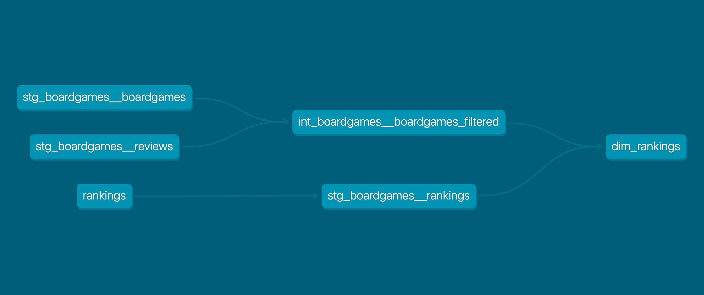
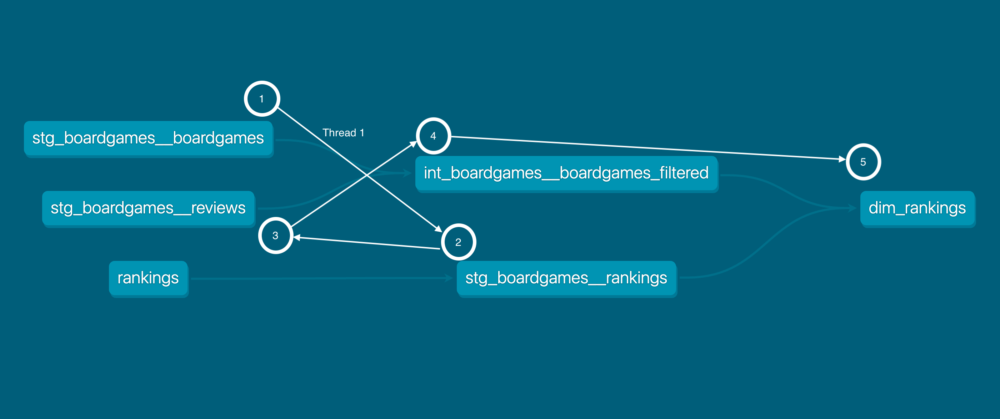
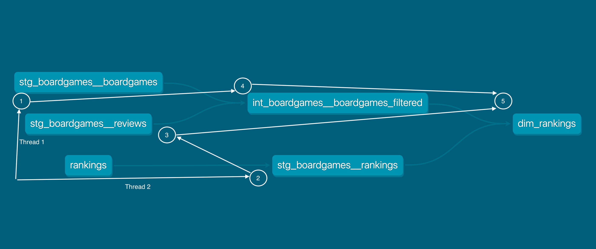
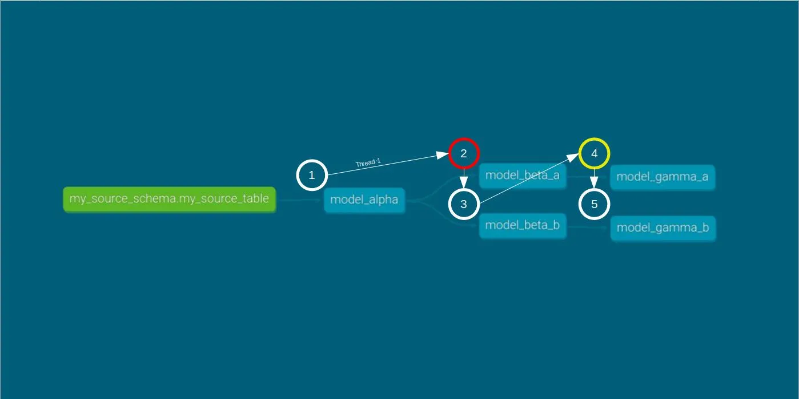
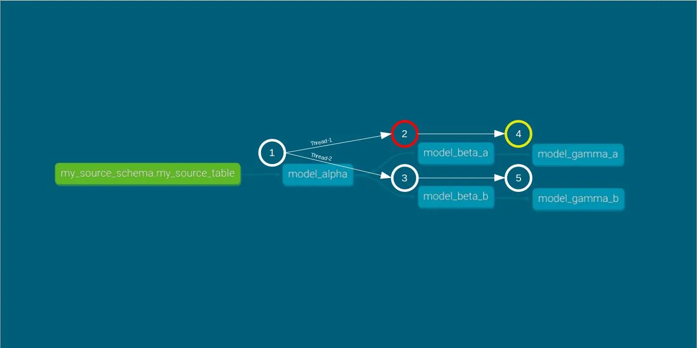

# Exercise:

## Understanding DAGs in dbt

### What is a DAG?
A DAG is a **D**irected **A**cyclic **G**raph, a type of graph whose nodes are directionally related to each other and don’t form a directional closed loop. In the practice of analytics engineering, DAGs are often used to visually represent the relationships between your data models.

DAGs are an effective tool to help you understand relationships between your data models and areas of improvement for your overall data transformations.

Take this mini-DAG for an example:



What can you learn from this DAG? You may notice a couple of things:
- `stg_boardgames__boardgames` and `stg_boardgames_reviews` are the parent models for `int_boardgames__boardgames_filtered`
- A join is happening between `stg_boardgames__boardgames` and `stg_boardgames_reviews` to form the `int_boardgames__boardgames_filtered` model
- `stg_boardgames__rankings` and `int_boardgames__boardgames_filtered` are the parents of `dim_rankings`
- `dim_rankings` is at the end of the DAG and is therefore downstream from a total of 5 different models

By looking briefly at this DAG, you can quickly unpack some of the most important elements about a project: dependencies and data lineage

Obviously, this is a simplified version of DAGs you may see in real life, but the practice of identifying relationships and data flows remains very much the same, regardless of the size of the DAG.

What happens if `stg_boardgames_reviews` just up and disappears one day? How would you know which models are potentially impacted by this change? Look at your DAG and understand model dependencies to mitigate downstream impacts.

### Modular data modeling best practices
There are some key elements that can help you create a more streamlined DAG and modular data models:

- Leveraging staging, intermediate, and mart layers to create layers of distinction between sources and transformed data
- Abstracting code that’s used across multiple models to its own model
- Joining on surrogate keys versus on multiple values
These are only a few examples of some best practices to help you organize your data models, business logic, and DAG.

### dbt and DAGs
As we're using dbt Core for this project, the Lineage Graph is available on dbt Docs. You can set it up by running the combined command `dbt docs generate && dbt docs serve` like you did on the [previous challenge](../18_generate_documentation/18_generate_documentation.md).
It can show a model or source’s entire lineage, all within a visual frame. 
You can check this [video tutorial](https://www.loom.com/share/593113a06f8640b48c2d792e03157059?sid=31962f4b-38fd-4b28-9dc4-9b6e57f03bfc) on how to check the lineage and how to navigate through that. 

You can check [dbt docs](https://docs.getdbt.com/terms/dag) for more details about `DAG`.

### Threads

When dbt runs, it creates a directed acyclic graph (DAG) of links between models. The number of threads represents the maximum number of paths through the graph dbt may work on at once – increasing the number of threads can minimize the run time of your project.

For example, if you specify `threads: 1`, dbt will start building only one model, and finish it, before moving onto the next. Specifying `threads: 8` means that dbt will work on up to 8 models at once without violating dependencies – the actual number of models it can work on will likely be constrained by the available paths through the dependency graph.

There's no set limit of the maximum number of threads you can set – while increasing the number of threads generally decreases execution time, there are a number of things to consider:

- Increasing the number of threads increases the load on your warehouse, which may impact other tools in your data stack. For example, if your BI tool uses the same compute resources as dbt, their queries may get queued during a dbt run.
- The number of concurrent queries your database will allow you to run may be a limiting factor in how many models can be actively built – some models may queue while waiting for an available query slot.

Generally the optimal number of threads depends on your data warehouse and its configuration. It’s best to test different values to find the best number of threads for your project. 

The recommendation is to start with 4. You define the number of threads in your `profile.yml` file, althouh we can use a different number of threads for a specific command by adding `--threads` option.


You can check [dbt docs](https://docs.getdbt.com/docs/running-a-dbt-project/using-threads) for more details about `threads`.

### Failing fast
Adding a `--fail-fast` argument flag to `dbt run` makes dbt exit immediately if a single resource fails to build. If other models are in-progress when the first model fails, then dbt will terminate the connections for these still-running models.

You can check [dbt docs](https://docs.getdbt.com/reference/global-configs/failing-fast) for more details about `failing fast`.

### Possible Scenarios

In a scenario were the below DAG runs using two thread, with the *fail fast* argument enabled, what whould happen if `stg_boardgames_rankings` encounters an error?


To tackle this question, we’ll explore three scenarios using the hypothetical DAG, aiming to observe the differences between running it with a single thread and running it with two threads. The three scenarios are:

- **Smooth Run:** Executing the DAG without any errors.
- **Error Run:** Running the DAG where `stg_boardgames_rankings` encounters an error.
- **Fail-Fast Error Run:** Executing the DAG with `stg_boardgames_rankings` encountering a error and the fail-fast argument enabled.


Let's try the 3 scenarios above, using the `stg_boardgames__rankings` model and only selecting the DAG lineage above.

#### 1) Smooth Run

1. Build only the 5 models (`rankings` is a snapshot, so not triggered by a `dbt run`) included on the mini-DAG showed above with a `--threads 1` to force using only 1 thread.

**Reminder:** The intermediate models like `int_boardgames__boardgames_filtered` are materialized as `ephemeral` which means they're CTEs not deployed on data warehouse.

2. For this exercise purpose only, we'll add a config block to ``int_boardgames__boardgames_filtered` to be materialized as a `view`.

You should get an output like the following:

```bash
❯ dbt run -s +dim_rankings --exclude source:boardgame --threads 1   
15:26:52  Running with dbt=1.7.4
15:26:53  Registered adapter: snowflake=1.7.1
15:26:53  Found 22 models, 1 snapshot, 68 tests, 2 seeds, 3 operations, 9 sources, 0 exposures, 0 metrics, 550 macros, 0 groups, 0 semantic models
15:26:53  
15:27:02  
15:27:02  Running 2 on-run-start hooks
15:27:02  1 of 2 START hook: dbt_certification_project.on-run-start.0 .................... [RUN]
15:27:04  1 of 2 OK hook: dbt_certification_project.on-run-start.0 ....................... [SUCCESS 1 in 1.70s]
15:27:04  2 of 2 START hook: dbt_certification_project.on-run-start.1 .................... [RUN]
15:27:05  2 of 2 OK hook: dbt_certification_project.on-run-start.1 ....................... [SUCCESS 1 in 1.10s]
15:27:05  
15:27:06  Concurrency: 1 threads (target='dev')
15:27:06  
15:27:06  1 of 5 START sql view model dbt_fbalseiro.stg_boardgames__boardgames ........... [RUN]
15:27:10  1 of 5 OK created sql view model dbt_fbalseiro.stg_boardgames__boardgames ...... [SUCCESS 1 in 3.89s]
15:27:10  2 of 5 START sql view model dbt_fbalseiro.stg_boardgames__rankings ............. [RUN]
15:27:13  2 of 5 OK created sql view model dbt_fbalseiro.stg_boardgames__rankings ........ [SUCCESS 1 in 3.13s]
15:27:13  3 of 5 START sql view model dbt_fbalseiro.stg_boardgames__reviews .............. [RUN]
15:27:16  3 of 5 OK created sql view model dbt_fbalseiro.stg_boardgames__reviews ......... [SUCCESS 1 in 3.19s]
15:27:16  4 of 5 START sql view model dbt_fbalseiro.int_boardgames__boardgames_filtered .. [RUN]
15:27:20  4 of 5 OK created sql view model dbt_fbalseiro.int_boardgames__boardgames_filtered  [SUCCESS 1 in 3.61s]
15:27:20  5 of 5 START sql incremental model dbt_fbalseiro.dim_rankings .................. [RUN]
15:27:25  5 of 5 OK created sql incremental model dbt_fbalseiro.dim_rankings ............. [SUCCESS 0 in 5.73s]
15:27:25  
15:27:25  Running 1 on-run-end hook
15:27:25  1 of 1 START hook: dbt_certification_project.on-run-end.0 ...................... [RUN]
15:27:27  1 of 1 OK hook: dbt_certification_project.on-run-end.0 ......................... [SUCCESS 1 in 1.59s]
15:27:27  
15:27:27  
15:27:27  Finished running 4 view models, 1 incremental model, 3 hooks in 0 hours 0 minutes and 34.19 seconds (34.19s).
15:27:27  
15:27:27  Completed successfully
15:27:27  
15:27:27  Done. PASS=5 WARN=0 ERROR=0 SKIP=0 TOTAL=5
```

The execution proceeds as expected, with all the models being ordered, compiled, and executed in succession. 
You can check below the model execution order:



3. Let's repeat the process using 2 threads instead

As expected, running the DAG with two threads results in a slightly shorter execution time compared to a single-thread run.

```bash
❯ dbt run -s +dim_rankings --threads 2                             
15:43:42  Running with dbt=1.7.4
15:43:43  Registered adapter: snowflake=1.7.1
15:43:43  Found 22 models, 1 snapshot, 68 tests, 2 seeds, 3 operations, 9 sources, 0 exposures, 0 metrics, 550 macros, 0 groups, 0 semantic models
15:43:43  
15:43:49  
15:43:49  Running 2 on-run-start hooks
15:43:49  1 of 2 START hook: dbt_certification_project.on-run-start.0 .................... [RUN]
15:43:51  1 of 2 OK hook: dbt_certification_project.on-run-start.0 ....................... [SUCCESS 1 in 1.46s]
15:43:51  2 of 2 START hook: dbt_certification_project.on-run-start.1 .................... [RUN]
15:43:52  2 of 2 OK hook: dbt_certification_project.on-run-start.1 ....................... [SUCCESS 1 in 1.05s]
15:43:52  
15:43:52  Concurrency: 2 threads (target='dev')
15:43:52  
15:43:52  1 of 5 START sql view model dbt_fbalseiro.stg_boardgames__boardgames ........... [RUN]
15:43:52  2 of 5 START sql view model dbt_fbalseiro.stg_boardgames__rankings ............. [RUN]
15:43:55  2 of 5 OK created sql view model dbt_fbalseiro.stg_boardgames__rankings ........ [SUCCESS 1 in 2.87s]
15:43:55  3 of 5 START sql view model dbt_fbalseiro.stg_boardgames__reviews .............. [RUN]
15:43:55  1 of 5 OK created sql view model dbt_fbalseiro.stg_boardgames__boardgames ...... [SUCCESS 1 in 2.97s]
15:43:58  3 of 5 OK created sql view model dbt_fbalseiro.stg_boardgames__reviews ......... [SUCCESS 1 in 2.82s]
15:43:58  4 of 5 START sql view model dbt_fbalseiro.int_boardgames__boardgames_filtered .. [RUN]
15:44:01  4 of 5 OK created sql view model dbt_fbalseiro.int_boardgames__boardgames_filtered  [SUCCESS 1 in 3.29s]
15:44:01  5 of 5 START sql incremental model dbt_fbalseiro.dim_rankings .................. [RUN]
15:44:07  5 of 5 OK created sql incremental model dbt_fbalseiro.dim_rankings ............. [SUCCESS 0 in 5.64s]
15:44:07  
15:44:07  Running 1 on-run-end hook
15:44:07  1 of 1 START hook: dbt_certification_project.on-run-end.0 ...................... [RUN]
15:44:09  1 of 1 OK hook: dbt_certification_project.on-run-end.0 ......................... [SUCCESS 1 in 1.54s]
15:44:09  
15:44:09  
15:44:09  Finished running 4 view models, 1 incremental model, 3 hooks in 0 hours 0 minutes and 25.71 seconds (25.71s).
15:44:09  
15:44:09  Completed successfully
15:44:09  
15:44:09  Done. PASS=5 WARN=0 ERROR=0 SKIP=0 TOTAL=5
```

As you can check by the execution order and threads according to above results, we only take advantage of using two threads until running the last model `dim_rankings`. That last model needs for both threads and models to be created up-front.



##### Solution

- [int_boardgames__boardgames_filtered.sql](./smooth_run/int_boardgames__boardgames_filtered.sql)

#### 2) Error Run

1. In this scenario, we intentionally introduce a division-by-zero error in ``stg_boardgames_rankings` to force an error during the DAG run.

2. Remove quotes from the "Rank" column to give an error.

3.  Execute the command `dbt run -s +dim_rankings --threads 1` and you should get an output like the following:

```bash
❯ dbt run -s +dim_rankings --threads 1
16:14:24  Running with dbt=1.7.4
16:14:25  Registered adapter: snowflake=1.7.1
16:14:25  Found 22 models, 1 snapshot, 68 tests, 2 seeds, 3 operations, 9 sources, 0 exposures, 0 metrics, 550 macros, 0 groups, 0 semantic models
16:14:25  
16:14:32  
16:14:32  Running 2 on-run-start hooks
16:14:32  1 of 2 START hook: dbt_certification_project.on-run-start.0 .................... [RUN]
16:14:34  1 of 2 OK hook: dbt_certification_project.on-run-start.0 ....................... [SUCCESS 1 in 1.38s]
16:14:34  2 of 2 START hook: dbt_certification_project.on-run-start.1 .................... [RUN]
16:14:34  2 of 2 OK hook: dbt_certification_project.on-run-start.1 ....................... [SUCCESS 1 in 0.57s]
16:14:34  
16:14:35  Concurrency: 1 threads (target='dev')
16:14:35  
16:14:35  1 of 5 START sql view model dbt_fbalseiro.stg_boardgames__boardgames ........... [RUN]
16:14:38  1 of 5 OK created sql view model dbt_fbalseiro.stg_boardgames__boardgames ...... [SUCCESS 1 in 3.28s]
16:14:38  2 of 5 START sql view model dbt_fbalseiro.stg_boardgames__rankings ............. [RUN]
16:14:41  2 of 5 ERROR creating sql view model dbt_fbalseiro.stg_boardgames__rankings .... [ERROR in 2.64s]
16:14:41  3 of 5 START sql view model dbt_fbalseiro.stg_boardgames__reviews .............. [RUN]
16:14:44  3 of 5 OK created sql view model dbt_fbalseiro.stg_boardgames__reviews ......... [SUCCESS 1 in 3.37s]
16:14:44  4 of 5 START sql view model dbt_fbalseiro.int_boardgames__boardgames_filtered .. [RUN]
16:14:48  4 of 5 OK created sql view model dbt_fbalseiro.int_boardgames__boardgames_filtered  [SUCCESS 1 in 3.59s]
16:14:48  5 of 5 SKIP relation dbt_fbalseiro.dim_rankings ................................ [SKIP]
16:14:48  
16:14:48  Running 1 on-run-end hook
16:14:48  1 of 1 START hook: dbt_certification_project.on-run-end.0 ...................... [RUN]
16:14:50  1 of 1 OK hook: dbt_certification_project.on-run-end.0 ......................... [SUCCESS 1 in 1.99s]
16:14:50  
16:14:50  
16:14:50  Finished running 4 view models, 1 incremental model, 3 hooks in 0 hours 0 minutes and 25.59 seconds (25.59s).
16:14:50  
16:14:50  Completed with 1 error and 0 warnings:
16:14:50  
16:14:50    Database Error in model stg_boardgames__rankings (models/staging/stg_boardgames__rankings.sql)
  000904 (42000): SQL compilation error: error line 21 at position 8
  invalid identifier 'RANK'
  compiled Code at target/run/dbt_certification_project/models/staging/stg_boardgames__rankings.sql
16:14:50  
16:14:50  Done. PASS=3 WARN=0 ERROR=1 SKIP=1 TOTAL=5
```

As expected, `stg_boardgames_rankings` is compiled and executed but fails to materialize due to the error. As a result of its dependency, `dim_rankings` is skipped, and materialization doesn't occur. Consistent with single-thread execution, compilation of `stg_boardgames__reviews` starts after `stg_boardgames_rankings` execution ends.

Below there is an example with a different project to illustrate what happened in this scenario with 1 thread (red represents the model with an error and yellow the model skipped):



4. Now, let's run the same DAG with two threads with the command `dbt run -s +dim_rankings --threads 2`

```bash
❯ dbt run -s +dim_rankings --threads 2
16:26:00  Running with dbt=1.7.4
16:26:01  Registered adapter: snowflake=1.7.1
16:26:01  Found 22 models, 1 snapshot, 68 tests, 2 seeds, 3 operations, 9 sources, 0 exposures, 0 metrics, 550 macros, 0 groups, 0 semantic models
16:26:01  
16:26:07  
16:26:07  Running 2 on-run-start hooks
16:26:07  1 of 2 START hook: dbt_certification_project.on-run-start.0 .................... [RUN]
16:26:09  1 of 2 OK hook: dbt_certification_project.on-run-start.0 ....................... [SUCCESS 1 in 1.43s]
16:26:09  2 of 2 START hook: dbt_certification_project.on-run-start.1 .................... [RUN]
16:26:09  2 of 2 OK hook: dbt_certification_project.on-run-start.1 ....................... [SUCCESS 1 in 0.67s]
16:26:09  
16:26:10  Concurrency: 2 threads (target='dev')
16:26:10  
16:26:10  1 of 5 START sql view model dbt_fbalseiro.stg_boardgames__boardgames ........... [RUN]
16:26:10  2 of 5 START sql view model dbt_fbalseiro.stg_boardgames__rankings ............. [RUN]
16:26:12  2 of 5 ERROR creating sql view model dbt_fbalseiro.stg_boardgames__rankings .... [ERROR in 2.50s]
16:26:12  3 of 5 START sql view model dbt_fbalseiro.stg_boardgames__reviews .............. [RUN]
16:26:13  1 of 5 OK created sql view model dbt_fbalseiro.stg_boardgames__boardgames ...... [SUCCESS 1 in 3.16s]
16:26:16  3 of 5 OK created sql view model dbt_fbalseiro.stg_boardgames__reviews ......... [SUCCESS 1 in 3.29s]
16:26:16  4 of 5 START sql view model dbt_fbalseiro.int_boardgames__boardgames_filtered .. [RUN]
16:26:19  4 of 5 OK created sql view model dbt_fbalseiro.int_boardgames__boardgames_filtered  [SUCCESS 1 in 3.37s]
16:26:19  5 of 5 SKIP relation dbt_fbalseiro.dim_rankings ................................ [SKIP]
16:26:19  
16:26:19  Running 1 on-run-end hook
16:26:19  1 of 1 START hook: dbt_certification_project.on-run-end.0 ...................... [RUN]
16:26:21  1 of 1 OK hook: dbt_certification_project.on-run-end.0 ......................... [SUCCESS 1 in 1.54s]
16:26:21  
16:26:21  
16:26:21  Finished running 4 view models, 1 incremental model, 3 hooks in 0 hours 0 minutes and 19.70 seconds (19.70s).
16:26:21  
16:26:21  Completed with 1 error and 0 warnings:
16:26:21  
16:26:21    Database Error in model stg_boardgames__rankings (models/staging/stg_boardgames__rankings.sql)
  000904 (42000): SQL compilation error: error line 21 at position 8
  invalid identifier 'RANK'
  compiled Code at target/run/dbt_certification_project/models/staging/stg_boardgames__rankings.sql
16:26:21  
16:26:21  Done. PASS=3 WARN=0 ERROR=1 SKIP=1 TOTAL=5
```

Similar to the single-thread case, `stg_boardgames__rankings` and `dim_rankings` do not materialize in the two-thread case. Also, compilation and execution of the other models occur concurrently, just as in the smooth run.

Below there is an example with a different project to illustrate what happened in this scenario with 2 threads (red represents the model with an error and yellow the model skipped):



##### Solution

- [stg_boardgames__rakings.sql](./error_run/stg_boardgames__rankings.sql)

#### 3) Fail-Fast Error Run

We now introduce the fail-fast argument into our DAG run using the command `dbt run -s +dim_rankings --threads 1 --fail-fast`.

```bash
❯ dbt run -s +dim_rankings --threads 1 --fail-fast
16:33:21  Running with dbt=1.7.4
16:33:22  Registered adapter: snowflake=1.7.1
16:33:22  Found 22 models, 1 snapshot, 68 tests, 2 seeds, 3 operations, 9 sources, 0 exposures, 0 metrics, 550 macros, 0 groups, 0 semantic models
16:33:22  
16:33:30  
16:33:30  Running 2 on-run-start hooks
16:33:30  1 of 2 START hook: dbt_certification_project.on-run-start.0 .................... [RUN]
16:33:31  1 of 2 OK hook: dbt_certification_project.on-run-start.0 ....................... [SUCCESS 1 in 1.29s]
16:33:31  2 of 2 START hook: dbt_certification_project.on-run-start.1 .................... [RUN]
16:33:32  2 of 2 OK hook: dbt_certification_project.on-run-start.1 ....................... [SUCCESS 1 in 0.52s]
16:33:32  
16:33:32  Concurrency: 1 threads (target='dev')
16:33:32  
16:33:32  1 of 5 START sql view model dbt_fbalseiro.stg_boardgames__boardgames ........... [RUN]
16:33:36  1 of 5 OK created sql view model dbt_fbalseiro.stg_boardgames__boardgames ...... [SUCCESS 1 in 3.48s]
16:33:36  2 of 5 START sql view model dbt_fbalseiro.stg_boardgames__rankings ............. [RUN]
16:33:39  2 of 5 ERROR creating sql view model dbt_fbalseiro.stg_boardgames__rankings .... [ERROR in 2.85s]
16:33:39  3 of 5 START sql view model dbt_fbalseiro.stg_boardgames__reviews .............. [RUN]
16:33:42  3 of 5 OK created sql view model dbt_fbalseiro.stg_boardgames__reviews ......... [SUCCESS 1 in 3.20s]
16:33:42  CANCEL query model.dbt_certification_project.stg_boardgames__reviews ........... [CANCEL]
16:33:42  
16:33:42    Database Error in model stg_boardgames__rankings (models/staging/stg_boardgames__rankings.sql)
  000904 (42000): SQL compilation error: error line 21 at position 8
  invalid identifier 'RANK'
  compiled Code at target/run/dbt_certification_project/models/staging/stg_boardgames__rankings.sql
16:33:42  
16:33:42  Running 1 on-run-end hook
16:33:42  1 of 1 START hook: dbt_certification_project.on-run-end.0 ...................... [RUN]
16:33:43  1 of 1 OK hook: dbt_certification_project.on-run-end.0 ......................... [SUCCESS 1 in 1.69s]
16:33:43  
16:33:44  
16:33:44  Finished running 4 view models, 1 incremental model, 3 hooks in 0 hours 0 minutes and 22.19 seconds (22.19s).
16:33:44  
16:33:44  Completed with 3 errors and 0 warnings:
16:33:44  
16:33:44    Database Error in model stg_boardgames__rankings (models/staging/stg_boardgames__rankings.sql)
  000904 (42000): SQL compilation error: error line 21 at position 8
  invalid identifier 'RANK'
  compiled Code at target/run/dbt_certification_project/models/staging/stg_boardgames__rankings.sql
16:33:44  
16:33:44    Skipping due to fail_fast
16:33:44  
16:33:44    Skipping due to fail_fast
16:33:44  
16:33:44  Done. PASS=2 WARN=0 ERROR=1 SKIP=2 TOTAL=5
```

As you can see above, `stg_boardgames__rankings` encounters an error and fails to materialize. Being a single-thread setup, a query cancelattion is triggered for `stg_boardgames__reviews` and the execution stops immediately, not being materialized.

Lastly, we run `dbt run -s +dim_rankings --threads 2 --fail-fast`.

Here we have the output:

```bash
❯ dbt run -s +dim_rankings --threads 2 --fail-fast
16:38:43  Running with dbt=1.7.4
16:38:44  Registered adapter: snowflake=1.7.1
16:38:44  Found 22 models, 1 snapshot, 68 tests, 2 seeds, 3 operations, 9 sources, 0 exposures, 0 metrics, 550 macros, 0 groups, 0 semantic models
16:38:44  
16:38:50  
16:38:50  Running 2 on-run-start hooks
16:38:50  1 of 2 START hook: dbt_certification_project.on-run-start.0 .................... [RUN]
16:38:51  1 of 2 OK hook: dbt_certification_project.on-run-start.0 ....................... [SUCCESS 1 in 1.35s]
16:38:51  2 of 2 START hook: dbt_certification_project.on-run-start.1 .................... [RUN]
16:38:52  2 of 2 OK hook: dbt_certification_project.on-run-start.1 ....................... [SUCCESS 1 in 0.57s]
16:38:52  
16:38:52  Concurrency: 2 threads (target='dev')
16:38:52  
16:38:52  1 of 5 START sql view model dbt_fbalseiro.stg_boardgames__boardgames ........... [RUN]
16:38:52  2 of 5 START sql view model dbt_fbalseiro.stg_boardgames__rankings ............. [RUN]
16:38:54  2 of 5 ERROR creating sql view model dbt_fbalseiro.stg_boardgames__rankings .... [ERROR in 2.43s]
16:38:54  3 of 5 START sql view model dbt_fbalseiro.stg_boardgames__reviews .............. [RUN]
16:38:55  1 of 5 OK created sql view model dbt_fbalseiro.stg_boardgames__boardgames ...... [SUCCESS 1 in 3.13s]
16:38:57  3 of 5 OK created sql view model dbt_fbalseiro.stg_boardgames__reviews ......... [SUCCESS 1 in 2.96s]
16:38:57  CANCEL query model.dbt_certification_project.stg_boardgames__boardgames ........ [CANCEL]
16:38:57  CANCEL query model.dbt_certification_project.stg_boardgames__reviews ........... [CANCEL]
16:38:57  
16:38:57    Database Error in model stg_boardgames__rankings (models/staging/stg_boardgames__rankings.sql)
  000904 (42000): SQL compilation error: error line 21 at position 8
  invalid identifier 'RANK'
  compiled Code at target/run/dbt_certification_project/models/staging/stg_boardgames__rankings.sql
16:38:57  
16:38:57  Running 1 on-run-end hook
16:38:57  1 of 1 START hook: dbt_certification_project.on-run-end.0 ...................... [RUN]
16:38:59  1 of 1 OK hook: dbt_certification_project.on-run-end.0 ......................... [SUCCESS 1 in 1.70s]
16:38:59  
16:39:00  
16:39:00  Finished running 4 view models, 1 incremental model, 3 hooks in 0 hours 0 minutes and 15.65 seconds (15.65s).
16:39:00  
16:39:00  Completed with 3 errors and 0 warnings:
16:39:00  
16:39:00    Database Error in model stg_boardgames__rankings (models/staging/stg_boardgames__rankings.sql)
  000904 (42000): SQL compilation error: error line 21 at position 8
  invalid identifier 'RANK'
  compiled Code at target/run/dbt_certification_project/models/staging/stg_boardgames__rankings.sql
16:39:00  
16:39:00    Skipping due to fail_fast
16:39:00  
16:39:00    Skipping due to fail_fast
16:39:00  
16:39:00  Done. PASS=2 WARN=0 ERROR=1 SKIP=2 TOTAL=5
```

This time, both `stg_boardgames__boardgames` and `stg_boardgames__rankings` were running side-by-side using the 2 available threads, so when `stg_boardgames__rankings` gives an error the execution stops immediately and neither model is materialized.

---

## Revert changes made on this challenge

Don't forget to revert the changes made on this challenge to advance to the next challenge.

Below you can find the original files before these updates:

- [stg_boardgames__rakings.sql](./revert_configs/stg_boardgames__rankings.sql)
- [int_boardgames__boardgames_filtered.sql](./revert_configs/int_boardgames__boardgames_filtered.sql)

---

[Return to Project Challenges](../../../README.md#9-project-challenges)